# SenseBox basic - Bauanleitung

In dieser Anleitung wird schrittweise beschrieben, wie die
SenseBox basic Umweltstation zusammengebaut und programmiert wird. Außderdem wird erläutert, wie die Station aufgestellt und angeschlossen werden sollte, damit die Datenübertragung auf die OpeneSenseMap reibungslos funktioniert.

Viel Spaß mit eurer neuen Messstation wünscht euch

das SenseBox-Team

## 1. Inventarliste

Die unten aufgeführte Hardware wird benötigt, um die Umweltstation anhand dieser Anleitung zusammen zu bauen.

### 1.1 Basiskomponenten

|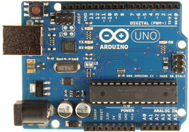|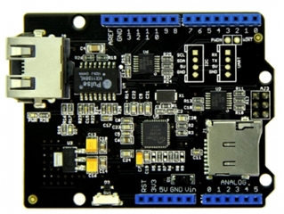|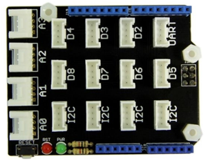|
|:------:|:------:|:------:|
|**Arduino Uno R3**|**W5200 Ethernet Shield V2.0**|**Grove - Base Shield V1.3**|

### 1.2 Sensoren

|||
|:--------:|:--------:|
|**Grove Barometer - Sensor BMP085**|**Grove Temperatur/Luftfeuchtigkeit - Sensor DHT11**|
|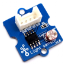|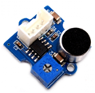|
|**Grove Helligkeit - Sensor GL5528**|**Grove Lautstärke - Sensor LM386**|

### 1.3 Zubehör

|")|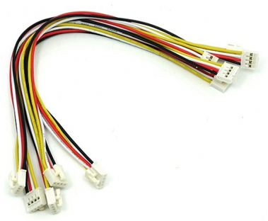|
|:---------:|:---------:|
|**Netzteil (9V, 0.6A)**|**Universal 4-Pin Kabel für Grove Sensoren**|
|")||
|**USB-Kabel (Typ A/B)**|**Netzwerkkabel (nicht im Lieferumfang enthalten)**|

Des weiteren solltet ihr eure SenseBox ID bereit halten. Die wird später benötigt um euere Messungen auf der OpenSenseMap zu veröffentlichen.
Falls ihr noch keine SenseBox ID habt, könnt ihr eure vorab [**hier**](http://opensensemap.org/#/getid) generieren oder bei der Registrierung auf  klicken.

## 2. Aufbau

Durch das einfach Stecksystem dauert der der Aufbau eurer Station nur wenige Minuten. Vorweg ein paar wichtige Hinweise die es zu beachten gilt.

### 2.1 Warnhinweise

* Durch elektrostatische Entladung können die Bauteile beschädigt oder sogar zerstört werden! Daher solltet ihr euch z.B. an einem Heizungsrohr entladen bevor ihr mit dem Aufbau anfangt
* Elektronische Bauteile und Leiterplatten können herstellungbedingt Chemikalien enthalten. Daher solltet ihr nach dem Aufbau oder Gebrauch euch die Hände waschen.
* Elektro- und Elektronikgeräte sollten umweltfreundlich entsort werden und bei Sammelstellen abgegeben bzw. recycelt werden.

### 2.2 Basisstation aufbauen

Der Kern unserer Station besteht aus drei Komponenten: dem *Arduino Uno* Mikrokontroller, dem *Ethernet Shield* und dem *Base Shield*.

Steckt als erstes das *Ethernet Shield* auf das *Arduino Uno*. Es erweitert den Kontroller mit der Möglichkeit Internetverbindungen aufzubauen. Außerdem ist ein MicroSD-Karten Slot zur Speicherung von Daten vorhanden, den wir vorerst für unsere Station aber nicht benötigen.

Ganz oben auf den Stapel steckt ihr nun das *Grove Base Shield*. Mit ihm lassen sich Sensoren mit den entsprechenden Kabeln einfach und schnell anschließen.

|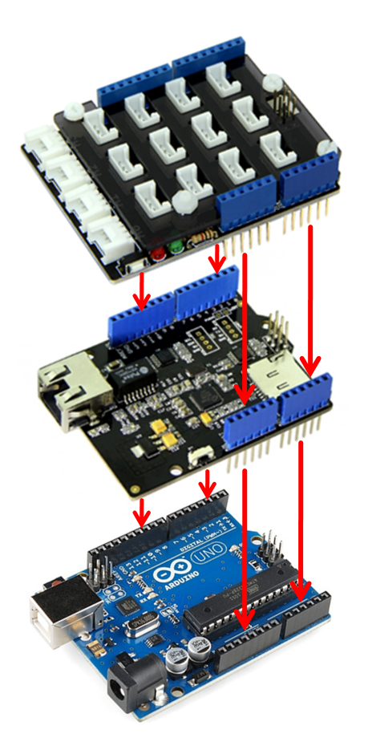|
|:------------:|
|**Platinenstapel der Basisstation**|

*Wichtig*: Achtet beim Stapeln der Schields darauf, dass alle Anschlüsse und Steckerleisten korrekt gesteckt sind!

### 2.3 Sensoren anschließen

An dem *Base Shield* lassen sich Sensoren, je nach Typ, an verschiedenen Schnittstellen anschließen. Für unser Setup brauchen wir drei der analogen Anschlüsse ("A0" bis "A2"), sowie einen der mit "I2C" gekennzeichneten seriellen Anschlüsse.

Im Prinzip ist es egal welchen analogen Anschluss ihr für einen analogen Sensor benutzt solang es später im Programm, welches auf den Mikrokontroller übertragen wird, vermerkt ist. Für das von uns bereit gestellte Programm haben wir folgende Belegungen für die Sensoren festgelegt:
* A0: Sound Sensor
* A1: Licht Sensor
* A2: Temperatur und Luftfeuchte Sensor
* I2C: Barometer

Welchen der I2C Anschlüsse ihr für das Barometer benutzt ist hingegen egal, da es sich dabei um einen Datenbus handelt, an dem Sensoren parallel angeschlossen werden können.

### 2.4 Station mit dem Netzwerk verbinden

Bevor der Code hochgeladen wird, solltet ihr die Messstation durch ein Netzwerkkabel mit eurem Heimnetzwerk verbinden. Die Station ist darauf ausgerichtet, dass das angeschlossene Netzwerk DHCP unterstützt. Falls das nicht der Fall sein sollte, lest den entsprechenden Eintrag in der Fehlerbehebung im Anhang. Dort steht beschrieben, wie man das Netzwerk manuell einrichten kann. An einer WLAN-Lösung wird momentan gearbeitet.

## 3. Programmierung

Hier beschreiben wir Schritt für Schritt wie man das *Arduino Uno* anschließen, installieren und programmieren muss. Diejenigen, die bereits Erfahrung im Umgang mit *Arduino-Boards* haben, können direkt die zusätzlichen Bibliotheken installieren und den SenseBo Sketch auf das Board laden. Für Arduino Einsteiger empfiehlt sich hingegen ein Blick auf [Erste Schritte mit Arduino](http://arduino.cc/de/Guide/HomePage), auf der die ersten Schritte mit dem Arduino ausführlich erklärt werden.

### 3.1 Arduino Software installieren

Ladet als erstes das Installationsprogramm für die *Arduino Software Version 1.0.5* von der [offiziellen Homepage](http://arduino.cc/en/Main/Software) herunter und führt es aus.
Danach wechselt ihr in eurem Browser auf unsere [*Github*](https://github.com/sensebox/arduino) Seite und ladet dort das Repository mit den benötigten Software-Bibliotheken über den .... Button am rechten Fensterrand herunter. In dieser zip-Datei befindet sich der Ordner "arduino-master", in dem sich wiederum drei Ordner mit Bibliotheken befinden, um die die *Arduino* Software erweitert werden muss.

Dazu öffnet ihr das *Arduino* Installationsverzeichnis (bei Windows in der Regel unter C:/Programme/Arduino zu finden). Dort befindet sich das Verzeichnis "libraries", in welches ihr die drei Ordner aus der zip-Datei ("Barometer_Sensor", "EthernetV2_0" und "Humidity_Temperature_Sensor") kopiert.

|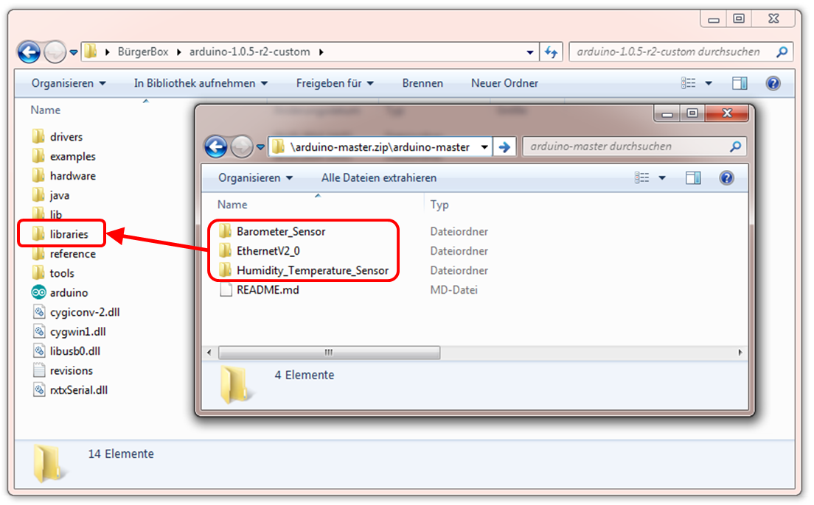|
|:-------:|
|**Kopieren der Bibliotheken**|

*Wichtig*: Falls die *Arduino* Software bereits gestartet wurde, müsst ihr nun das Programm neustarten, damit die neuen Bibliotheken korrekt geladen werden.

### 3.2 Arduino IDE konfigurieren

Nachdem ihr die Bibliotheken installiert habt, könnt ihr mit dem USB-Kabel die Station an den Rechner anschließen und die *Arduino Entwicklungsumgebung* (kurz: Arduino IDE) öffnen.

Dort müsst ihr unter dem Reiter "Tools" -> "Board" das richtige *Arduino Board* auswählen. In unserem Fall also "Arduino Uno".

|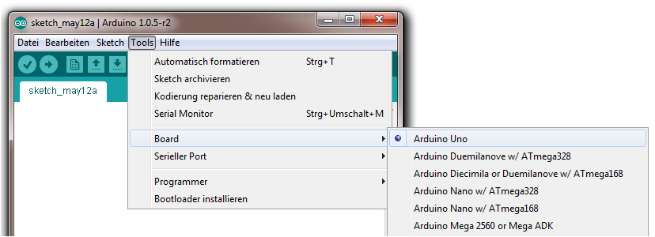|
|:-------:|
|**Arduino Board auswählen**|

Außerdem müsst ihr einen seriellen Port angeben, über den die Kommunikation zwischen Computer und Mikrokontroller läuft. Wählt dazu unter "Tools" -> "Serieller Port" den COM-Port aus, der von dem Treiber beim Anschließen des Arduino Uno geladen werden sollte.

| |
|:-------:|
|**COM-Port auswählen**|

Falls euch dort kein COM-Port zur Auswahl vorgeschlagen wird, lest bitte den entsprechenden Abschnitt zur Fehlerbehebung im Anhang.

### 3.3 Registrierung auf der OpenSenseMap

Ein Software-Programm für einen *Arduino Mikrokontroller* nennt man auch Sketch. Seit der *Arduino IDE Version 1.0* werden alle Sketch-Dateien ausschließlich durch die Dateiendung ".ino" gekennzeichnet. Eine solche ino-Datei benötigt ihr nun, um eure Station zu programmieren. Den passenden Sketch zu der SenseBox Umweltstation bekommt ihr, wenn ihr eure Station bei uns auf der OpenSenseMap registriert.
Wählt dazu auf [OpenSenseMap](http://sensebox.uni-muenster.de/opensensemap/) die Option "Registrierung" aus. Dort könnt ihr die vorkonfigurierte Option für die SenseBox Umweltstation mit dem ... Symbol auswählen. In dem darauf folgenden Formular müsst ihr nun einen Namen für die Station angeben, den Typ auf "stationär" einstellen und die SenseBox ID eintragen, die ihr von uns bereits per E-Mail erhalten habt. An der Sensorauswahl müsst ihr nichts mehr ändern und könnt eure Auswahl nun speichern.

*Wichtig*: Der Standort eurer Station sollte möglichst genau mit Hilfe der kleinen Karte auf der rechten Seite angegeben werden, damit die Messdaten korrekt räumlich zugeordnet werden können.

### 3.4 Übertragung der Daten

Nach erfolgreicher Registrierung wird euch vom OpenSenseMap Server eine ino-Datei erzeugt, die ihr über den Link im erscheinenden Textdialog aufrufen könnt. Wählt den kompletten Text von dieser Seite aus (Shortcut *Strg+A*), kopiert ihn (Shortcut *Strg+C*) und fügt ihn in der *Arduino IDE* (oder in einen Texteditor) wieder ein (Shortcut *Strg+V*). Dort speichert ihr die Datei erstmal ab, damit ihr eine Sicherungskopie habt. Beim abspeichern solltet ihr darauf achten, dass ihr die Datei mit der korrekten Endung z.B. "sensebox.ino" abspeichert.

|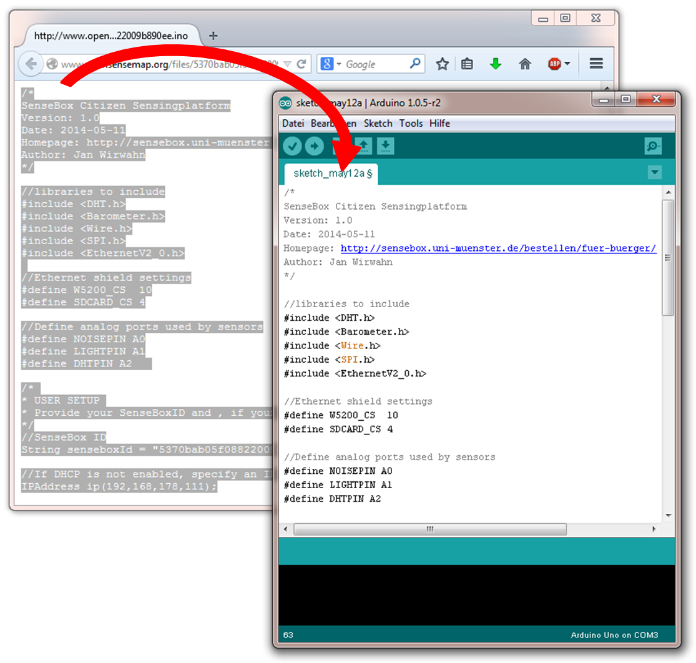 |
|:-------:|
|**Kopieren des Sourcecode**|

*Wichtig*: Der erzeugte Code ist genau auf eure Station und eure SenseBox ID angepasst, daher solltet ihr ihn gut abspeichern!

### 3.4 Sketch auf das Arduino Board hochladen

Der Sketch wird auf das *Arduino Uno* geladen, indem ihr auf das ... Symbol in der Arduino IDE klickt. Nach einer kurzen Weile bekommt ihr eine Rückmeldung vom Programm, dass der Sketch hochgeladen wurde. Um nun zu testen ob das Programm mit den Einstellungen funktioniert, ruft ihr den seriellen Monitor über den ... Button auf. Das sich daraufhin öffnende Fenster zeigt einige Ausgaben der Sensoren, sowie Statusberichte der Verbindungsversuche mit dem OpenSenseMap Server an.
Am unteren Rand des Fensters kann man die Übertragungsrate (Baud-Rate) einstellen. Falls es noch nicht der Fall ist, muss sie auf 9600 gesetzt werden.

Wenn alles richtig angeschlossen und das Netzwerk über DHCP konfiguriert wird, könnt ihr den Monitor verfolgen wie jede Minute Sensormessungen übertragen werden, und in der Serverantwort die Statusmeldung zurückgegeben wird.

## 4. Aufstellen

Bevor die Station aufgestellt wird, sollten sie vorher 1-2 Tage testen, ob alle Sensoren funktionieren und die Datenübertragung läuft.
Wenn alles funktioniert, kann die Station für den Außeneinsatz vorbereitet werden.

Benötigt wird:
* kleines geschlossenes Schutzgehäuse (IP 55)
* keines belüftetes (oder nach unten hin offenes) Schutzgehäuse
* Heißkleber

### 4.1 Standortwahl

Die Platzwahl einer Messstation wirkt sich direkt auf die gemessenen Werte aus. Daher solltet ihr euch gut überlegen wo ihr eigentlich messen wollt, bevor ihr die Station fest installiert. Natürlich kann sich der Standort der Station über die Zeit hin ändern, allerding werden die Messungen erst richtig aussagekräftig, wenn man eine längere Zeitreihe aufnimmt.
Damit die Messdaten für die Forschung, aber auch für Bürger interessant werden, empfehlen wir die Station draußen an einem festen Standort zu installieren um möglichst repräsentative Daten für eure Umgebung zu sammeln. Dabei müssen eineige Punkte beachtet werden:
* Basisstation muss vor Wasserschäden geschützt werden
* Sensoren sollten vor direkter Sonneneinstrahlung abgeschirmt werden
* Stromversorgung und Netzwerkanschluss muss gewährleistet werden

### 4.2 Wasserfestes Gehäuse

Der Hauptteil der Messstation (*Arduino Uno, Ethernet Shield* und *Grove Base Shield*) muss unter allen Umständen wasserdicht eingeschlossen werden. Daher sollte der Basisteil der Station in einem Gehäuse der Schutzart *IP55* untergebracht werden. Solche Gehäuse sind in jedem Baumarkt oder im Internet erhältlich.
Für die einzelnen Sensoren ist weiterhin folgendes zu beachten:

Barometer sollte,
* vor direkter Sonneneinstrahlung geschützt werden
* mit möglichst konstanter Temperatur betrieben werden

Thermometer sollte,
* vor direkter Sonneneinstrahlung geschützt werden
* von anderen Wärmequellen getrennt werden
* Luftzufuhr von außen bekommen

Lichtsensor sollte,
* vor direkter Sonneneinstrahlung geschützt werden
* nicht in einem undurchsichtigen Gehäuse untergebracht sein

Mikrofon sollte,
* nicht in einem komplett geschlossenen Gehäuse untergebracht sein

### 4.3 Exemplarischer Aufbau

Wie bereit erwähnt, muss vor allem das Gehäuse mit der Basisstation Regen- und Spritzwasser abhalten, damit kein Kurzschluss entstehen und die Station nicht beschädigt wird. Dazu wird die Basisstation (siehe folgende Abbildung) mit Heißkleber in ein IP55 Gehäuse geklebt. In das selbe Gehäuse sollte der Drucksensor untergebracht werden, der am besten unter konstanten Temperaturbedingungen arbeitet, was durch die Eigenwärme des Arduino gegeben wird.

Die analogen Sensoren (Schall, Licht, Temperatur & Luftfeuchte) sollten separat in einem durchlüfteten Gehäuse angebracht werden, für das folgendes gelten muss:
* Regen abweisen und nach oben hin geschlossen sein
* Luftdurchlässig sein durch Belüftungslöcher o. Ä. (siehe Abbildung)

*Wichtig*: Die Kabel der Sensoren als auch Netzwer- und Stromkabel müssen nach unten aus dem Gehäuse gehen! Außerdem ist beim Stromanschluss besondere Vorsicht dabei geboten, den Stecker wasserfest anzubringen!

|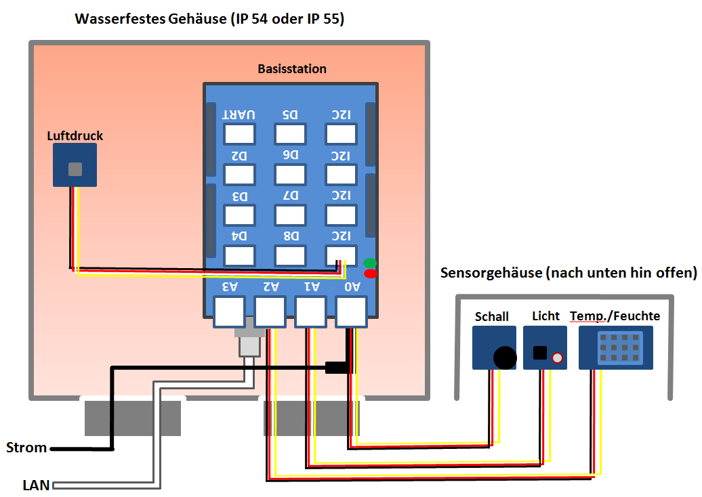 |
|:-------:|
|**Exemplarischer Stationsaufbau**|
